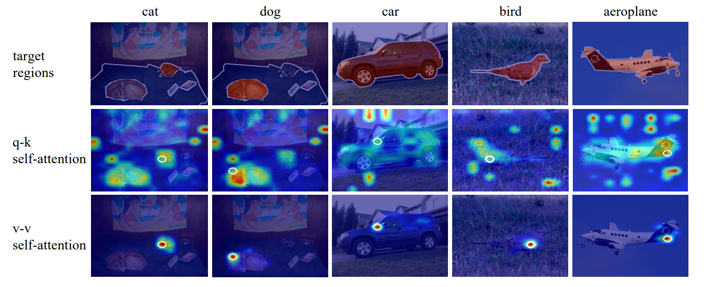
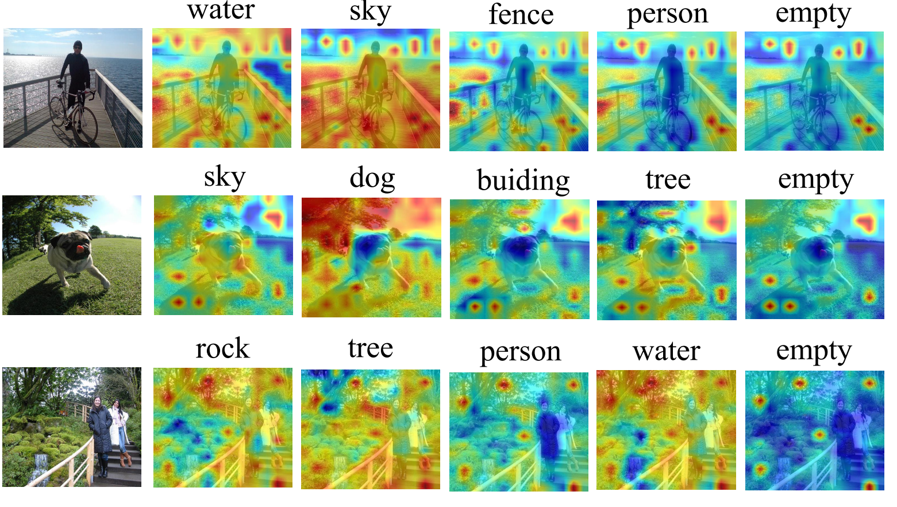
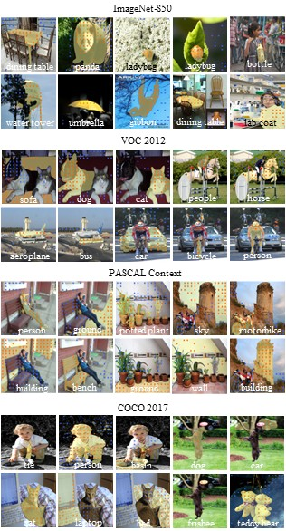
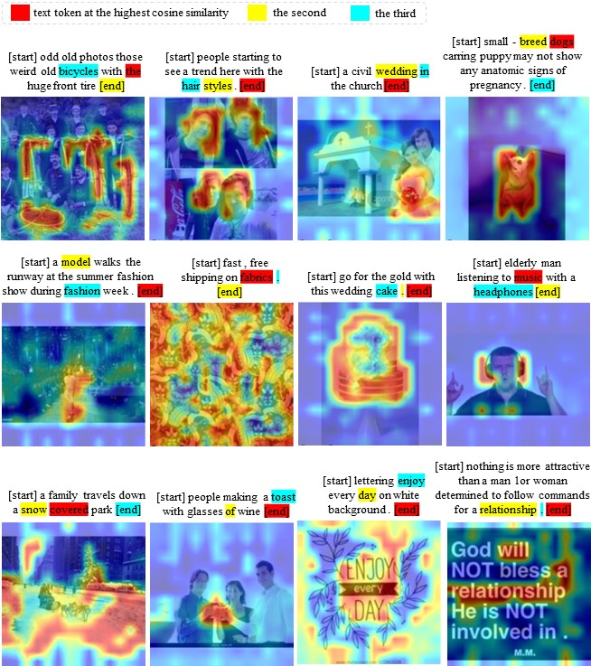
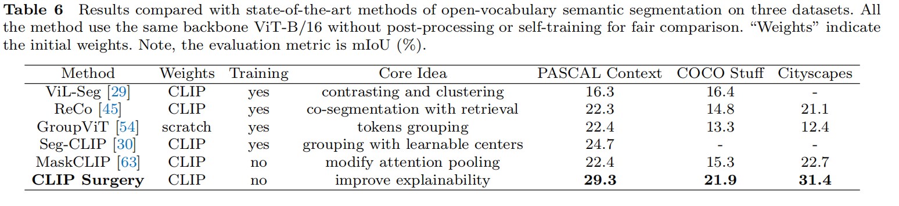
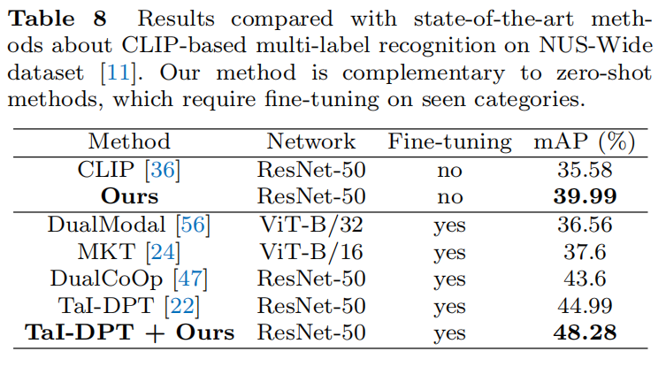

# CLIP Surgery for Better Explainability with Enhancement in Open-Vocabulary Tasks ([arxiv](https://arxiv.org/abs/2304.05653))

## Introduction

This work focuses on the explainability of CLIP via its raw predictions. We identify two problems about CLIP's explainability: opposite visualization and noisy activations. Then we propose the CLIP Surgery, which does not require any fine-tuning or additional supervision. It greatly improves the explainability of CLIP, and enhances downstream open-vocabulary tasks such as multi-label recognition, semantic segmentation, interactive segmentation (specifically the Segment Anything Model, SAM), and multimodal visualization. Currently, we offer a simple demo for interpretability analysis, and how to convert text to point prompts for SAM. Rest codes including evaluation and other tasks will be released later.

Opposite visualization is due to wrong relation in self-attention:


Noisy activations is owing to redundant features across lables:


Our visualization results:


Text2Points to guide SAM:


Multimodal visualization:


Segmentation results:


Multilabel results:


## Demo

Firstly to install the SAM, and download the model
```
pip install git+https://github.com/facebookresearch/segment-anything.git
wget https://dl.fbaipublicfiles.com/segment_anything/sam_vit_h_4b8939.pth
```

Then explain CLIP via jupyter demo ["demo.ipynb"](https://github.com/xmed-lab/CLIP_Surgery/blob/master/demo.ipynb).
Or use the python file:
```
python demo.py
```
(Note: demo's results are slightly different from the experimental code, specifically no apex amp fp16 for easier to use.)

## Cite
```
@misc{li2023clip,
      title={CLIP Surgery for Better Explainability with Enhancement in Open-Vocabulary Tasks}, 
      author={Yi Li and Hualiang Wang and Yiqun Duan and Xiaomeng Li},
      year={2023},
      eprint={2304.05653},
      archivePrefix={arXiv},
      primaryClass={cs.CV}
}
```
